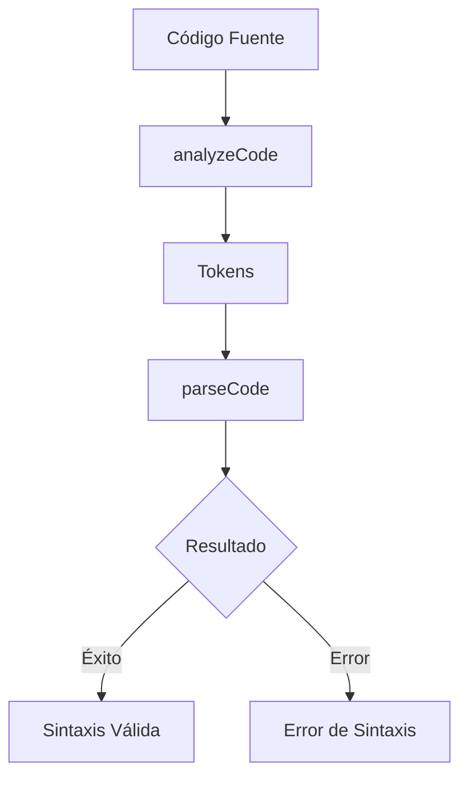

# Analizador Léxico Web "Lexify"

Proyecto desarrollado en React para realizar análisis léxico y sintáctico en la web, implementando un motor de análisis basado en Autómatas Finitos Deterministas (DFA) y un parser LL(1) de descenso recursivo.

## Especificaciones técnicas:

### Stack Tecnológico:
- __Frontend Framework:__ React con Vite como herramienta de construcción.
- __Lenguaje de Implementación:__ JavaScript (ES6+).
- __Estilos:__ CSS con efecto Glassmorphism y animaciones CSS.

### Estructura del Proyecto:

```
src/  
├── components/  
│   ├── App.jsx          # Componente principal y controlador UI  
│   └── App.css          # Estilos Glassmorphism  
├── utils/  
│   ├── analyzer.js      # Analizador léxico (DFA-based)  
│   └── parser.js        # Parser sintáctico (LL1 Recursive Descent)  
└── main.jsx             # Punto de entrada  
```

### Características de la Interfaz:

- Editor de código con límite de 1000 caracteres.
- Importación de archivos (.txt, .minilang, .json, .cpp, .java, .c).
- Exportación de resultados a CSV con soporte UTF-8 (BOM para Excel).
- Ejemplos predefinidos de código (básico, condicional, ciclo, con error).

## Funcionamiento y Modelo/Motor de Análisis:

### Motor de Análisis Léxico (analyzer.js):

El analizador léxico implementa un Autómata Finito Determinista (DFA) que transforma el código fuente en un flujo de tokens mediante expresiones regulares.

#### Proceso de Tokenización:

1. __Entrada:__ Código fuente dividido por líneas.
2. __Patrones Regex:__ Se aplican 13 patrones diferentes en orden específico.
3. __Clasificación:__ Cada lexema se clasifica en una categoría de token.
4. __Manejo de Errores:__ Caracteres no reconocidos generan tokens LEXICAL_ERROR.

#### Tipos de Tokens Reconocidos:

 Tipo | Ejemplo | Descripción |
|------|---------|-------------|
| KEYWORD | int, float, if, while | Palabras reservadas |
| IDENTIFIER | edad, nombre | Nombres de variables |
| INTEGER_LITERAL | 25, 100 | Constantes enteras |
| DECIMAL_LITERAL | 9.5, 3.14 | Constantes decimales |
| STRING_LITERAL | "Hola" | Cadenas de texto |
| ARITHMETIC_OP | +, -, *, / | Operadores matemáticos |
| RELATIONAL_OP | ==, !=, >, < | Operadores de comparación |
| LOGICAL_OP | &&, \|\|, ! | Operadores lógicos |

### Motor de Análisis Sintáctico (`parser.js`):
El parser implementa un **parser LL(1) de descenso recursivo** que valida la gramática del lenguaje MiniLang

#### Lenguaje MiniLang
MiniLang es un lenguaje didáctico simplificado que incluye:
- **Tipos de datos**: int, float, string, bool
- **Estructuras de control**: if-else, while
- **Funciones**: print (salida estándar)
- **Operadores**: aritméticos, relacionales, lógicos

#### Gramática de MiniLang
El lenguaje soporta las siguientes construcciones sintácticas.

- **Declaración**: `<tipo> ID = <expr>;`
- **Asignación**: `ID = <expr>;`
- **Condicional**: `if (<cond>) { <sentencias> } [else { <sentencias> }]`
- **Ciclo**: `while (<cond>) { <sentencias> }`
- **Impresión**: `print(<expr>);`

#### Precedencia de Operadores
Las expresiones aritméticas manejan la precedencia mediante producciones separadas:
- `<term>` maneja `*` y `/` (mayor precedencia)
- `<expr>` maneja `+` y `-` (menor precedencia)
- Producciones "prime" eliminan la recursión izquierda para compatibilidad LL(1)

## Flujo de Análisis Completo


## Ejemplos de Código
El proyecto incluye archivos de prueba en el directorio :

**Ejemplo Básico**:
```minilang
int edad = 25;
float salario = 1500.50;
string puesto = "Desarrollador";
print(edad);
```

**Ejemplo Condicional**:
```minilang
int puntuacion = 85;
if (puntuacion >= 70.0) {
  print("Aprobado");
} else {
  print("Reprobado");
}
```

## Manejo de Errores
- **Errores Léxicos**: Caracteres no reconocidos se marcan como `LEXICAL_ERROR`.
- **Errores Sintácticos**: El parser proporciona mensajes detallados con línea y expectativa.
- **Validación previa**: El parser verifica errores léxicos antes de iniciar el análisis sintáctico.

## Contributors

<table align="center">
  <tr>
    <td align="center">
      <a href="https://github.com/Chapinguin">
        
      </a>
      <br />
      <sub><b>Sebastian Chapa (Chapinguin)</b></sub>
      <br />
      <sub>Full Stack Developer</sub>
    </td>
    <td align="center">
      <a href="https://github.com/guco-17">
        
      </a>
      <br />
      <sub><b>Gustavo Cortes (guco-17)</b></sub>
      <br />
      <sub>Full Stack Developer</sub>
    </td>
  </tr>
</table>

# Members
[@Chapinguin](https://github.com/Chapinguin)
[@guco-17](https://github.com/guco-17)